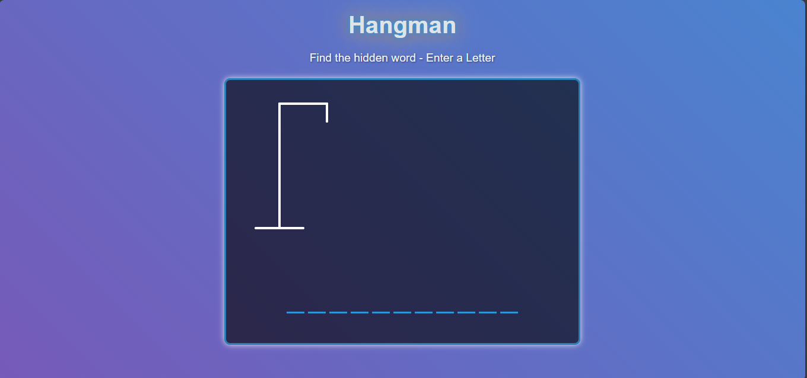

# 🎮 Hangman Game

This **Hangman Game** is a fun and interactive word-guessing game built using **React.js**. Players try to guess a hidden word by selecting letters one at a time. Be careful — too many incorrect guesses and it's game over!

---

## 🚀 Features

- 🎯 Random word selection
- 🧠 Tracks correct and incorrect guesses
- ⌛ Game over on too many wrong guesses
- 🔄 Option to restart the game
- 🎨 Simple and user-friendly interface

---

## 🛠️ Tech Stack

- **React.js** (Frontend)

---

## 📸 Screenshots
### 🖥️ Gameplay Preview

---

## 🧩 How to Play

1. A hidden word is chosen at random.
2. Guess the word by clicking on alphabet letters.
3. Each correct letter is revealed in the word.
4. Every incorrect guess draws part of the hangman.
5. Guess the word before the hangman is fully drawn!

---

